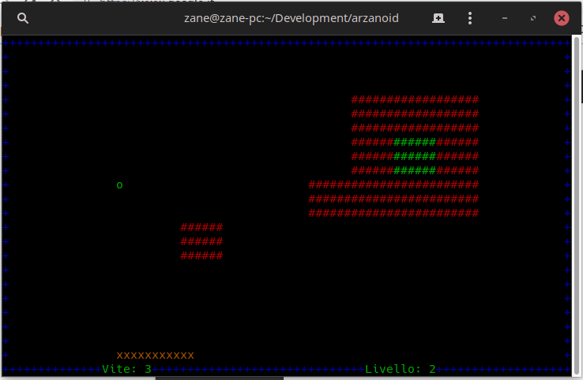

# Arzanoid

## Introduction

Arzanoid is a remake of **Arkanoid**, an iconic videogame developed in '80s.



## Game rules

A set of 55 various, randomly generated, levels, created to test your abilities. Every level has a single goal: break the green brick. Here there is the list of commands:

- Left/Right Arrow to move
- Space to start the level

## Installation

Open your terminal in the project's root folder and execute this commands:

```
make
./arzanoid

```
### Enjoy it!

**Developed by Antonino Agostino (Zane)**
